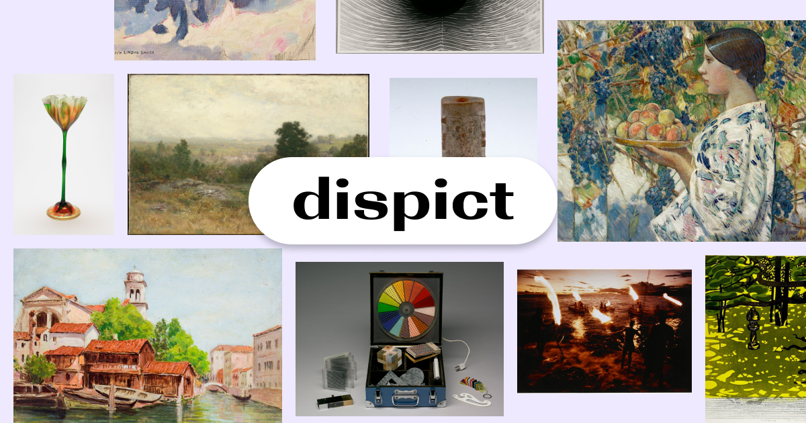

# Dispict: a creative aesthetics tool

Design a growing artistic exhibit of your own making, with semantic search
powered by OpenAI CLIP. Bring your own labels and context.

[](https://dispict.com)

**[dispict.com](https://dispict.com)** greets you with a blank canvas. You begin
typing. Your writing becomes a _label_, and related artworks appear spatially
around the text you wrote. As you pan and zoom around the gallery, you can try
other labels to see how the artwork shifts in aesthetic quality.

Focus on a single work to see its context: artist, setting, history, and
narrative descriptions. This crucially allows you to learn about the story of
the art being presented.

## Motivation

There's currently a lot of excitement about computers helping creatives find
inspiration by generating original art pieces from text prompts
([1](https://openai.com/dall-e-2/), [2](https://www.midjourney.com/),
[3](https://stability.ai/blog/stable-diffusion-public-release)). But these lose
the unique, genuine part of walking through an art museum where every work has
been lovingly created by humans, and the viewer is surrounded by _insight_ and
_intention_. What if computers could connect us with masterpieces made by
artists of the past?

The Harvard Art Museums' online collection is huge, containing over 200,000
digitized works. This is far more than can be easily taken in by a single
person. So instead, we apply computation to what it's good at: finding patterns
and connections.

**Creativity and curiosity require associative thinking.** Just like the
technological innovations of centuries past have changed the aesthetic character
of fine art from literal portraiture to more flexible modes of self-expression,
_Dispict_ hopes to be technology that explores the honest, intimate relationship
of the creative process with artistic discovery.

## Technical Details

_Dispict_ uses real-time machine learning. It's built on contrastive
language-image pretraining (CLIP) and nearest-neighbor search, served from
Python (on a [Modal](https://modal.com/) endpoint) with a handcrafted
[Svelte](https://svelte.dev/) frontend.

### Development

If you want to hack on dispict yourself, you can run the frontend development
server locally using [Node v16](https://nodejs.org/) or higher:

```shell
npm install
npm run dev
```

This will automatically connect to the serverless backend recommendation system
hosted on Modal. To additionally change this part of the code, you need to
create a Modal account, then install [Python 3.10+](https://www.python.org/) and
follow these steps:

1. Run the Jupyter notebooks `notebooks/load_data.ipynb` and
   `notebooks/data_cleaning.ipynb` to download data from the Harvard Art
   Museums. This will produce two files named `data/artmuseums[-clean].json`.
2. Run `SKIP_WEB=1 modal run main.py` to spawn a parallel Modal job that
   downloads and embeds all images in the dataset using
   [CLIP](https://openai.com/blog/clip/), saving the results to
   `data/embeddings.hdf5`.
3. Run `modal deploy main.py` to create the web endpoint, which then gives you a
   public URL such as `https://ekzhang-dispict-suggestions.modal.run`.

You can start sending requests to the URL to get recommendations. For example,
`GET /?text=apple` will find artwork related to apples, such as the image shown
below.

<p align="center">
<a href="https://harvardartmuseums.org/collections/object/230725">

</a>
</p>

To point the web application at your new backend URL, you can set an environment
variable to override the default backend.

```shell
VITE_APP_API_URL=https://[your-app-endpoint].modal.run npm run dev
```

## Acknowledgements

Created by Eric Zhang ([@ekzhang1](https://twitter.com/ekzhang1)) for
[Neuroaesthetics](https://mbb.harvard.edu/) at Harvard. All code is licensed
under [MIT](LICENSE), and data is generously provided by the
[Harvard Art Museums](https://www.harvardartmuseums.org/) public access
collection.

I learned a lot from Jono Brandel's [_Curaturae_](https://curaturae.com/) when
designing this.
